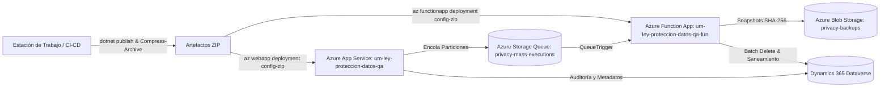

# Skill: Despliegue a Azure (App Service & Function App) — Protección de Datos UMayor

Guía técnica integral y estandarizada para la compilación, empaquetado, configuración de infraestructura y despliegue a Microsoft Azure de los dos componentes centrales de cómputo del sistema:
1. **API Web Orquestadora (.NET 8 Minimal APIs)** en **Azure App Service**.
2. **Motor de Procesamiento Asíncrono (.NET 8 Isolated Worker)** en **Azure Function App**.

---

## 1. Contexto General y Arquitectura de Despliegue



### Inventario de Componentes y Recursos en Azure

| Recurso | Entorno DEV | Entorno QA (Referencia) | Entorno PROD |
| :--- | :--- | :--- | :--- |
| **Resource Group** | `admincrm2021_rg_0225` | `admincrm2021_rg_0225` | *(RG Producción UMayor)* |
| **App Service (API Web)** | `um-ley-proteccion-datos-dev` | `um-ley-proteccion-datos-qa` | `um-ley-proteccion-datos-prod` |
| **Function App (Workers)** | `um-ley-proteccion-datos-dev-fun` | `um-ley-proteccion-datos-qa-fun` | `um-ley-proteccion-datos-prod-fun` |
| **Storage Account** | Cuenta Storage DEV | Cuenta Storage QA | Cuenta Storage PROD |
| **Storage Queue** | `privacy-mass-executions` | `privacy-mass-executions` | `privacy-mass-executions` |
| **Blob Container** | `privacy-backups` | `privacy-backups` | `privacy-backups` |
| **URL Dataverse** | *(Org CRM DEV)* | `https://qas-umayor.crm2.dynamics.com` | `https://umayor.crm2.dynamics.com` |
| **Mecanismo de Despliegue** | Azure CLI ZipDeploy | Azure CLI ZipDeploy | Azure CLI ZipDeploy / DevOps |

---

## 2. Requisitos Previos e Instrucciones de Autenticación

> [!IMPORTANT]
> **Autenticación Azure CLI y MFA:**
> Debido a las directivas de acceso condicional con Autenticación de Múltiples Factores (MFA) de la Universidad Mayor, los comandos no deben forzar `az login` desatendido con credenciales hardcodeadas.
> Asegúrese de contar con una **sesión autenticada activa** en PowerShell ejecutando:
> ```powershell
> az account show
> ```
> Si la sesión expiró, inicie sesión interactivamente una sola vez:
> ```powershell
> az login
> az account set --subscription "<ID-o-Nombre-de-Suscripcion-UMayor>"
> ```

### Herramientas requeridas en la estación de despliegue:
* **.NET SDK 8.0** (`dotnet --version` >= 8.0.x)
* **Azure CLI** (`az --version` >= 2.50.x)
* **PowerShell 5.1** o **PowerShell 7+**

---

## 3. Secuencia Rápida de Despliegue a QA (Paso a Paso)

Desde la raíz del repositorio (`d:\Proyectos\Umayor.Dynamics.DeletePoc.MassOrchestration.v1`), ejecute la siguiente secuencia en PowerShell:

```powershell
# ==============================================================================
# 1. LIMPIEZA DE ARTEFACTOS PREVIOS
# ==============================================================================
Write-Host "Limpiando artefactos previos..." -ForegroundColor Cyan
Remove-Item -Path ".\publish_web", ".\publish_fun" -Recurse -Force -ErrorAction SilentlyContinue
Remove-Item -Path ".\publish_web.zip", ".\publish_fun.zip" -Force -ErrorAction SilentlyContinue

# ==============================================================================
# 2. COMPILACIÓN Y PUBLICACIÓN EN MODO RELEASE
# ==============================================================================
Write-Host "Compilando Web API..." -ForegroundColor Cyan
dotnet publish .\Umayor.Dynamics.DeletePoc.csproj -c Release -o .\publish_web

Write-Host "Compilando Azure Function Worker..." -ForegroundColor Cyan
dotnet publish .\Umayor.Dynamics.DeletePoc.Functions\Umayor.Dynamics.DeletePoc.Functions.csproj -c Release -o .\publish_fun

# ==============================================================================
# 3. EMPAQUETADO EN ARCHIVOS ZIP
# ==============================================================================
Write-Host "Empaquetando artefactos ZIP..." -ForegroundColor Cyan
Compress-Archive -Path .\publish_web\* -DestinationPath .\publish_web.zip -Force
Compress-Archive -Path .\publish_fun\* -DestinationPath .\publish_fun.zip -Force

# ==============================================================================
# 4. DESPLIEGUE A AZURE APP SERVICE Y FUNCTION APP (QA)
# ==============================================================================
$RG = "admincrm2021_rg_0225"
$API_APP = "um-ley-proteccion-datos-qa"
$FUN_APP = "um-ley-proteccion-datos-qa-fun"

Write-Host "Desplegando Web API a App Service ($API_APP)..." -ForegroundColor Yellow
az webapp deployment source config-zip --resource-group $RG --name $API_APP --src .\publish_web.zip

Write-Host "Desplegando Worker a Function App ($FUN_APP)..." -ForegroundColor Yellow
az functionapp deployment source config-zip --resource-group $RG --name $FUN_APP --src .\publish_fun.zip

Write-Host "Reiniciando servicios para refrescar ensamblados..." -ForegroundColor Cyan
az webapp restart --resource-group $RG --name $API_APP
az functionapp restart --resource-group $RG --name $FUN_APP

Write-Host "¡Despliegue a QA completado exitosamente!" -ForegroundColor Green
```

---

## 4. Despliegue en Otros Ambientes y Migración a un Nuevo Entorno (4to Entorno)

### 4.1. Despliegue a DEV y PROD
Para desplegar en **DEV**:
```powershell
.\deploy_azure.ps1 -Environment dev
```
O manualmente:
```powershell
az webapp deployment source config-zip -g admincrm2021_rg_0225 -n um-ley-proteccion-datos-dev --src .\publish_web.zip
az functionapp deployment source config-zip -g admincrm2021_rg_0225 -n um-ley-proteccion-datos-dev-fun --src .\publish_fun.zip
az webapp restart -g admincrm2021_rg_0225 -n um-ley-proteccion-datos-dev
az functionapp restart -g admincrm2021_rg_0225 -n um-ley-proteccion-datos-dev-fun
```

Para desplegar en **PROD**:
> [!CAUTION]
> **Condiciones críticas para Producción:**
> 1. Asegurar que `Safety__DeletionEnabled` esté configurado inicialmente en `false`.
> 2. Asegurar que el secreto de la aplicación en Entra ID esté vigente y configurado en los Application Settings.
> 3. Disponer de aprobación formal institucional.

```powershell
.\deploy_azure.ps1 -Environment prod -ResourceGroup "<RG_PROD>" -ApiAppName "um-ley-proteccion-datos-prod" -FunAppName "um-ley-proteccion-datos-prod-fun"
```

---

### 4.2. Procedimiento para Pasar el Proyecto a un Entorno Nuevo (4to Entorno / Custom)

Cuando el usuario indique pasar o subir el proyecto a un entorno nuevo (por ejemplo `STAGING`, `DR`, `SANDBOX`, `TEST-2` o `PROD-2`), el agente y el operador deben seguir este flujo estructurado:

#### FASE 1: Checklist de Información Necesaria (Qué se requiere solicitar al usuario)
Para dar de alta un entorno nuevo, se deben definir o solicitar los siguientes parámetros:

1. **Datos de Azure:**
   - **`ResourceGroup`**: Nombre del grupo de recursos en Azure donde residirán los servicios.
   - **`ApiAppName`**: Nombre asignado al App Service (Web API .NET 8 Linux).
   - **`FunAppName`**: Nombre asignado a la Function App (Worker .NET 8 Isolated).
   - **`StorageAccount`**: Nombre de la cuenta de almacenamiento Azure Storage.
2. **Datos de Dataverse (CRM):**
   - **`Dataverse__Url`**: URL de la organización Dynamics 365 objetivo (ej: `https://umayor-staging.crm2.dynamics.com`).
   - **`Dataverse__TenantId`**: Tenant ID de Microsoft Entra ID.
   - **`Dataverse__ClientId`**: ID de cliente del Application Registration.
   - **`Dataverse__ClientSecret`**: Secreto de cliente vigente.
3. **Validación de Seguridad:**
   - **`Safety__RequireEnvironmentContains`**: Cadena distintiva en minúsculas que debe estar contenida en la URL de Dataverse (ej: `"staging"` o `"sandbox"`).
   - **`Safety__DeletionEnabled`**: Debe fijarse inicialmente en `"false"`.
4. **Pre-requisito en Dataverse:**
   - Importar la solución empaquetada (`AppSolution`) en el nuevo Dataverse para crear las tablas `um_massexecution`, `um_massexecutiondetail` y `um_privacyoperationlog`.
   - Asignar el rol de seguridad al usuario de aplicación (Application User).

---

#### FASE 2: Orquestación del Aprovisionamiento de Storage
Si la cuenta de almacenamiento es nueva, se deben crear la cola y el contenedor de blobs:

```powershell
$RG_NEW = "<NOMBRE_RESOURCE_GROUP>"
$STORAGE_NEW = "<NOMBRE_STORAGE_ACCOUNT>"

# Obtener Connection String
$CONN_STR = az storage account show-connection-string -g $RG_NEW -n $STORAGE_NEW --query connectionString -o tsv

# Crear cola de particiones y contenedor inmutable de backups
az storage queue create --name "privacy-mass-executions" --connection-string $CONN_STR
az storage container create --name "privacy-backups" --connection-string $CONN_STR --public-access off
```

---

#### FASE 3: Configuración de Application Settings en el Nuevo Entorno
Inyectar las variables obligatorias en el App Service y Function App del nuevo entorno:

```powershell
# 1. Configurar App Service (Web API)
az webapp config appsettings set -g $RG_NEW -n "<API_APP_NEW>" --settings `
    Dataverse__Url="<DATAVERSE_URL_NEW>" `
    Dataverse__TenantId="<TENANT_ID>" `
    Dataverse__ClientId="<CLIENT_ID>" `
    Dataverse__ClientSecret="<CLIENT_SECRET>" `
    Safety__RequireEnvironmentContains="<ENV_SUBSTRING>" `
    Safety__RequireConfirmationText="ELIMINAR" `
    Safety__DeletionEnabled="false" `
    AzureStorage__ConnectionString="$CONN_STR" `
    AzureStorage__QueueName="privacy-mass-executions" `
    AzureStorage__ContainerName="privacy-backups" `
    MassOrchestration__MaxBatchSize="500" `
    MassOrchestration__MaxUploadRows="50000" `
    MassOrchestration__PartitionSize="500"

# 2. Configurar Function App (Worker)
az functionapp config appsettings set -g $RG_NEW -n "<FUN_APP_NEW>" --settings `
    AzureWebJobsStorage="$CONN_STR" `
    FUNCTIONS_WORKER_RUNTIME="dotnet-isolated" `
    Dataverse__Url="<DATAVERSE_URL_NEW>" `
    Dataverse__TenantId="<TENANT_ID>" `
    Dataverse__ClientId="<CLIENT_ID>" `
    Dataverse__ClientSecret="<CLIENT_SECRET>" `
    Safety__RequireEnvironmentContains="<ENV_SUBSTRING>" `
    Safety__RequireConfirmationText="ELIMINAR" `
    Safety__DeletionEnabled="false" `
    AzureStorage__ConnectionString="$CONN_STR" `
    AzureStorage__ContainerName="privacy-backups"
```

---

#### FASE 4: Orquestación del Upload y Despliegue con un Solo Comando
Con los recursos y settings listos, ejecutar el script automatizado para compilar, empaquetar, subir y validar:

```powershell
.\deploy_azure.ps1 -Environment "custom" `
                   -ResourceGroup $RG_NEW `
                   -ApiAppName "<API_APP_NEW>" `
                   -FunAppName "<FUN_APP_NEW>" `
                   -StorageAccount $STORAGE_NEW `
                   -ProvisionStorage
```

El script se encargará de:
1. Verificar la sesión activa de Azure CLI.
2. Comprobar y aprovisionar el Storage (`-ProvisionStorage`).
3. Limpiar compilaciones residuales.
4. Compilar ambos proyectos en Release (.NET 8).
5. Empaquetar en archivos ZIP.
6. Subir (Upload ZipDeploy) a la Web API y a la Function App.
7. Reiniciar ambos servicios.
8. Ejecutar el Smoke Test post-despliegue (`/api/diagnostics/build`).

---


## 5. Configuración de Variables en Azure (Application Settings)

Tanto el App Service como la Function App requieren variables de entorno específicas configuradas en Azure Portal (o vía `az webapp config appsettings set` / `az functionapp config appsettings set`).

### 5.1. Variables Requeridas para el App Service (Web API)

```powershell
az webapp config appsettings set --resource-group admincrm2021_rg_0225 --name um-ley-proteccion-datos-qa --settings `
    Dataverse__Url="https://qas-umayor.crm2.dynamics.com" `
    Dataverse__TenantId="<TENANT_ID>" `
    Dataverse__ClientId="<APP_CLIENT_ID>" `
    Dataverse__ClientSecret="<APP_CLIENT_SECRET>" `
    Safety__RequireEnvironmentContains="qa" `
    Safety__RequireConfirmationText="ELIMINAR" `
    Safety__DeletionEnabled="false" `
    AzureStorage__ConnectionString="<STORAGE_CONNECTION_STRING>" `
    AzureStorage__QueueName="privacy-mass-executions" `
    AzureStorage__ContainerName="privacy-backups" `
    MassOrchestration__MaxBatchSize="500" `
    MassOrchestration__MaxUploadRows="50000" `
    MassOrchestration__PartitionSize="500"
```

### 5.2. Variables Requeridas para la Function App (Worker)

```powershell
az functionapp config appsettings set --resource-group admincrm2021_rg_0225 --name um-ley-proteccion-datos-qa-fun --settings `
    AzureWebJobsStorage="<STORAGE_CONNECTION_STRING>" `
    FUNCTIONS_WORKER_RUNTIME="dotnet-isolated" `
    Dataverse__Url="https://qas-umayor.crm2.dynamics.com" `
    Dataverse__TenantId="<TENANT_ID>" `
    Dataverse__ClientId="<APP_CLIENT_ID>" `
    Dataverse__ClientSecret="<APP_CLIENT_SECRET>" `
    Safety__RequireEnvironmentContains="qa" `
    Safety__RequireConfirmationText="ELIMINAR" `
    Safety__DeletionEnabled="false" `
    AzureStorage__ConnectionString="<STORAGE_CONNECTION_STRING>" `
    AzureStorage__ContainerName="privacy-backups"
```

> [!TIP]
> Si la infraestructura utiliza **Managed Identity (Identidad Administrada)** en lugar de cadenas de conexión con clave compartida, configure `AzureStorage__AccountUrl="https://<cuenta>.blob.core.windows.net"` y asigne el rol *Storage Blob Data Contributor* y *Storage Queue Data Contributor* a la identidad del App Service y Function App.

---

## 6. Aprovisionamiento Inicial de Recursos de Almacenamiento

Si se despliega en un nuevo ambiente o suscripción, asegúrese de que la cola y el contenedor existan antes de ejecutar procesos masivos:

```powershell
# Obtener Connection String del Storage Account
$STORAGE_NAME = "<nombre-cuenta-storage>"
$CONN_STR = az storage account show-connection-string -g $RG -n $STORAGE_NAME --query connectionString -o tsv

# Crear Cola de Particiones
az storage queue create --name "privacy-mass-executions" --connection-string $CONN_STR

# Crear Contenedor de Respaldo Criptográfico
az storage container create --name "privacy-backups" --connection-string $CONN_STR --public-access off
```

---

## 7. Verificación Post-Despliegue (Smoke Tests)

### Test 1: Verificar Endpoint de Diagnóstico y Versión de Compilación
```powershell
$build = Invoke-RestMethod -Uri "https://um-ley-proteccion-datos-qa.azurewebsites.net/api/diagnostics/build" -Method Get
$build | Format-List
```
*Respuesta esperada:*
* `apiBuild`: Código de versión actual (ej: `mass-orchestration-v1-20260804-file-mass`).
* `dataverseUrl`: `https://qas-umayor.crm2.dynamics.com`.
* `environment`: `Production` o `QA`.

### Test 2: Smoke Test de Consulta Individual (Sin Modificar Datos)
```powershell
$body = @{
    rut = "171752728"
    pasaporte = ""
    mode = "Consultar"
    confirmationText = ""
} | ConvertTo-Json

$resp = Invoke-RestMethod -Uri "https://um-ley-proteccion-datos-qa.azurewebsites.net/api/execute-single" `
                          -Method Post `
                          -Body $body `
                          -ContentType "application/json"
$resp | ConvertTo-Json -Depth 4
```
*Respuesta esperada:*
* `status`: `"Consultado"` o `"NoEncontrado"`.
* `executionId`: GUID no nulo.
* `audit.created`: `true` (validando conectividad y permisos con Dataverse).

### Test 3: Verificar Catálogo de Reportería
```powershell
$catalog = Invoke-RestMethod -Uri "https://um-ley-proteccion-datos-qa.azurewebsites.net/api/reports/catalog" -Method Get
Write-Host "Reportes disponibles: $($catalog.Count)" -ForegroundColor Green
```

### Test 4: Monitoreo en Vivo de la Function App
Para comprobar que los workers asíncronos están escuchando la cola sin errores:
```powershell
az functionapp log tail --resource-group admincrm2021_rg_0225 --name um-ley-proteccion-datos-qa-fun
```

---

## 8. Actualización del Custom Connector en Power Apps

Cuando se modifiquen contratos de API o endpoints, actualice el conector personalizado en Power Apps:

1. El archivo con el contrato oficial Swagger 2.0 compatible con Power Apps es:
   `d:\Proyectos\Umayor.Dynamics.DeletePoc.MassOrchestration.v1\swagger_custom_connector_mass.yaml`
2. Ingrese a [Power Apps Portal](https://make.powerapps.com/).
3. Seleccione el entorno correspondiente (**UMayor QA** o **UMayor DEV**).
4. Vaya a **Datos** (o **Dataverse**) > **Conectores personalizados**.
5. Seleccione el conector `UM - Ley Proteccion Datos` y haga clic en **Editar**.
6. En la barra superior, seleccione **Actualizar desde archivo OpenAPI** (o arrastre el archivo `swagger_custom_connector_mass.yaml`).
7. En la pestaña **General**, verifique el host objetivo (`um-ley-proteccion-datos-qa.azurewebsites.net`).
8. Haga clic en **Actualizar conector**.
9. En la pestaña **Probar**, cree una nueva conexión y valide una prueba de `/api/execute-single`.

---

## 9. Procedimiento de Rollback

En caso de incidentes críticos tras una publicación:

1. **Reversión Inmediata de Binarios:**
   Si se conservan los paquetes ZIP de la versión anterior (`publish_web_prev.zip` y `publish_fun_prev.zip`):
   ```powershell
   az webapp deployment source config-zip -g admincrm2021_rg_0225 -n um-ley-proteccion-datos-qa --src .\publish_web_prev.zip
   az functionapp deployment source config-zip -g admincrm2021_rg_0225 -n um-ley-proteccion-datos-qa-fun --src .\publish_fun_prev.zip
   ```
2. **Bloqueo Preventivo de Eliminaciones:**
   Si se requiere detener inmediatamente cualquier operación de purga sin detener la API:
   ```powershell
   az webapp config appsettings set -g admincrm2021_rg_0225 -n um-ley-proteccion-datos-qa --settings Safety__DeletionEnabled="false"
   az functionapp config appsettings set -g admincrm2021_rg_0225 -n um-ley-proteccion-datos-qa-fun --settings Safety__DeletionEnabled="false"
   ```

---

## 10. Diagnóstico y Resolución de Problemas Comunes

| Síntoma / Error | Causa Probable | Solución |
| :--- | :--- | :--- |
| **`az login` falla con error de MFA** | Se intenta pasar credenciales por script no interactivo | Ejecutar `az login` manualmente en la terminal para completar el flujo en navegador con autenticador. |
| **HTTP 502 / 503 Bad Gateway tras despliegue** | El proceso .NET no arrancó o falló `SafetyValidator` | Verificar la cadena de conexión de Dataverse o mismatch de `Safety__RequireEnvironmentContains` (ej: configurado `qa` pero URL apunta a `dev`). Revisar Application Logs en Azure. |
| **Lotes masivos se quedan en estado "Pendiente"** | La Function App no está corriendo o no tiene configurado `AzureWebJobsStorage` | Verificar que `um-ley-proteccion-datos-qa-fun` esté iniciada y que `AzureWebJobsStorage` apunte a la misma cuenta de almacenamiento que `AzureStorage__ConnectionString` de la API. |
| **Error `Customer Address can not be deleted`** | Dataverse bloquea borrado directo de `customeraddress` en `EliminarTodoMenosContacto` | Comportamiento esperado resuelto automáticamente por el saneador de direcciones. La API anonimiza los campos de contacto y reporta residuo saneado sin fallar. |
| **Error de timeout en ZipDeploy** | Conexión lenta o archivo ZIP muy pesado | Desplegar por separado el Web API y la Function App. Asegurar que las carpetas de compilación no contengan logs o archivos temporales. |
