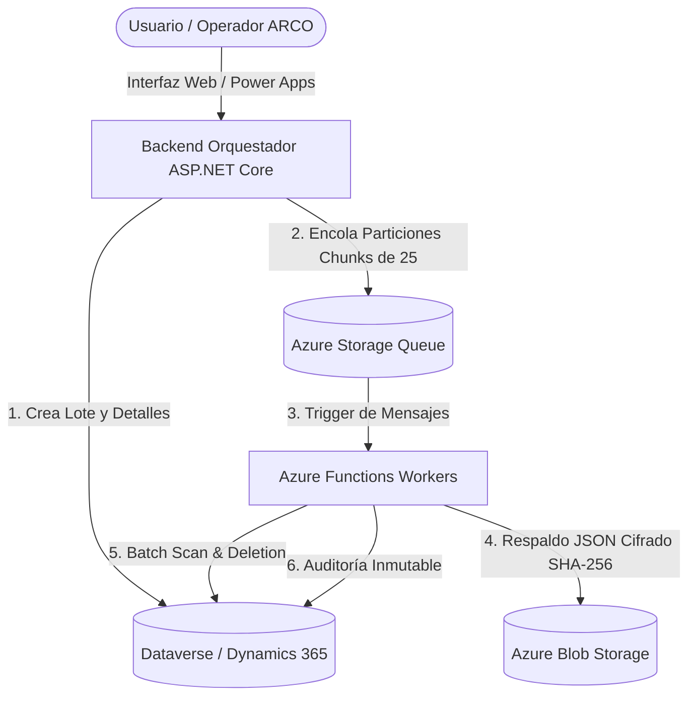

# Sistema de Protección de Datos Personales - Universidad Mayor

Plataforma empresarial de grado de producción diseñada para dar cumplimiento a la **Ley de Protección de Datos Personales (Derechos ARCO)** en la **Universidad Mayor**, permitiendo la consulta, anonimización y eliminación profunda de contactos y toda su red de dependencias relacionales en **Microsoft Dynamics 365 (Dataverse)** de manera segura, auditable, respaldada y altamente optimizada.

---

## 1. Arquitectura General del Sistema

El sistema opera bajo una arquitectura distribuida y desacoplada en Microsoft Azure y Microsoft Power Platform:



### Componentes Principales:

1. **Frontend / Interfaces de Usuario**:
   - **Portal Web Integrado**: Aplicación web moderna (HTML5/CSS3 Vanilla con glassmorphism y tema oscuro) ubicada en `wwwroot/`, para carga masiva de archivos CSV/Excel, monitoreo en tiempo real y ejecución individual.
   - **Power Apps Canvas App**: Aplicación Canvas integrada (`AppSolution/` y `AppSource/`) que consume la API mediante un Custom Connector OpenAPI (`swagger_custom_connector_mass.yaml`).

2. **Backend Orquestador (Azure App Service - ASP.NET Core 8.0)**:
   - Proyecto: `Umayor.Dynamics.DeletePoc.csproj` (`Program.cs`).
   - Expone endpoints REST para ejecución individual (`/api/execute-single`), orquestación de lotes masivos (`/api/mass/upload`, `/api/mass/start/{id}`, `/api/mass/status/{id}`), reportes regulatorios (`/api/reports/...`) y recuperación en segundo plano (`OutboxRecoveryWorker`).

3. **Motor de Procesamiento Asíncrono (Azure Functions v4 .NET 8 Isolated)**:
   - Proyecto: `Umayor.Dynamics.DeletePoc.Functions.csproj` (`QueueProcessorFunction.cs`).
   - Workers elásticos que procesan colas de Azure Storage (`privacy-mass-executions`) con manejo de *worker leases*, autodetección de identificadores (RUT chileno / Pasaporte) y reconciliación de estados ambiguos.

4. **Biblioteca de Servicios Compartidos (`Umayor.Dynamics.DeletePoc.Shared`)**:
   - `MatrixDeletionService.cs`: Motor de análisis de dependencias (Batch Scan) y purga en bloque sobre más de 20 entidades de Dataverse.
   - `BlobStorageBackupService.cs` / `BackupService.cs`: Generación de respaldos completos en formato JSON comprimido antes de cualquier borrado.
   - `PrivacyOperationLogService.cs`: Registro de auditoría reglamentaria inmutable (`um_privacyoperationlog`).
   - `DataverseConnectionFactory.cs`: Gestión de conexiones optimizadas con ServiceClient y OAuth.
   - `SafetyValidator.cs` e `InputValidator.cs`: Reglas estrictas de validación de formato, listas de exclusión y texto de confirmación `"ELIMINAR"`.

---

## 2. Modos de Tratamiento y Operación

El sistema admite tres modos de tratamiento para cada solicitud:

| Modo de Tratamiento | Comportamiento | Confirmación Requerida |
| :--- | :--- | :---: |
| **`EliminarTodo`** | Escanea y elimina todas las entidades dependientes del contacto y finalmente el registro `contact` en Dynamics. Realiza respaldo previo en Blob Storage. | `"ELIMINAR"` |
| **`EliminarTodoMenosContacto`** | Elimina todas las interacciones, actividades, casos y leads dependientes, pero anonimiza y preserva el registro base `contact`. | `"ELIMINAR"` |
| **`Consultar`** | Modo de solo lectura / escaneo. Genera la matriz de entidades y volumen de datos asociados al RUT/Pasaporte sin modificar la base de datos. | *(No requerida)* |

---

## 3. Matriz de Dependencias y Entidades Relacionadas

El servicio `MatrixDeletionService` analiza y procesa recursivamente las siguientes entidades de Dataverse:

```
[contact] (Entidad Principal)
  ├── lead (originatingleadid / parentcontactid)
  ├── incident (Casos / customerid / primarycontactid / wit_caso)
  ├── phonecall (Llamadas / regardingobjectid)
  ├── email (Correos / regardingobjectid)
  ├── task (Tareas / regardingobjectid)
  ├── appointment (Citas)
  ├── wit_actividadchat / wit_whatsapp / wit_sms (Mensajería)
  ├── activitypointer / activityparty (Punteros de actividad)
  ├── customeraddress (Direcciones de contacto)
  ├── wit_colegio (Colegios / wit_director, wit_orientador, etc.)
  ├── wit_ingresofamiliarbruto / wit_tramo (Ingresos socioeconómicos)
  ├── annotation (Notas y adjuntos)
  ├── msdyn_ocliveworkitem (Conversaciones Omnichannel)
  └── post / postcomment / follow (Muro y seguimiento social)
```

> [!NOTE]
> **Mecanismo de Desvinculación Automática (Unlinking Fallback):**
> Si un plugin interno o regla de negocio heredada de Dynamics falla al intentar eliminar una entidad secundaria (como `phonecall`, `wit_colegio` o `wit_ingresofamiliarbruto`), el sistema captura la excepción y ejecuta automáticamente la desvinculación del campo `regardingobjectid` / `contactid`, garantizando que el contacto no quede bloqueado y se cumpla la ley sin interrumpir la operación.

---

## 4. Pipeline de Seguridad y Respaldo Criptográfico

Antes de que se ejecute cualquier instrucción `Delete` en Dataverse, el sistema ejecuta el siguiente flujo de seguridad:

1. **Validación de Identidad**: Valida que el RUT cumpla el algoritmo Módulo 11 chileno o que el Pasaporte sea válido.
2. **Validación de Frase de Seguridad**: Requiere confirmación explícita (`confirmationText = "ELIMINAR"`).
3. **Generación de Snapshot en Memoria**: Recupera la totalidad de atributos del contacto y sus registros hijos.
4. **Almacenamiento Criptográfico en Blob Storage**:
   * Ruta: `mass-executions/{headerId}/{detailId}_backup.json` (o `individual-backups/{date}/{id}_backup.json`).
   * Calcula el Hash **SHA-256** del archivo generado.
   * Registra el tamaño exacto en bytes y la fecha UTC.
5. **Auditoría en Dataverse (`um_privacyoperationlog`)**:
   * Guarda payloads JSON completos de la petición, respuesta, matrices previa/posterior y referencia al backup.

---

## 5. Optimizaciones de Rendimiento Extremo

El sistema cuenta con optimizaciones clave que reducen el tiempo de purga de ~70 segundos a **~5.5 segundos por registro**:

1. **Batch Scan vía FetchXML Agrupado**: Consulta en paralelo todas las relaciones del contacto en un solo lote de consultas optimizadas.
2. **Reutilización Directa de Entidad (`preFetchedContact`)**: El contacto localizado en la validación inicial se pasa directamente en memoria al motor de borrado, evitando roundtrips de red redundantes hacia Dynamics.
3. **Agregación Consolidada de Cabecera (Zero Lock Contention)**: En lugar de actualizar la cabecera `um_massexecution` registro a registro con bloqueos de concurrencia optimista (`IfRowVersionMatches`), los contadores se actualizan en bloque al completar la partición.
4. **Particionado Inteligente de Cola (`PartitionSize: 25`)**: Las listas masivas se dividen en fragmentos de 25 registros para activar la escalabilidad horizontal y concurrente de múltiples instancias de Azure Functions.
5. **Mecanismo de Idempotencia**: Detección de logs de auditoría existentes para evitar reprocesamientos accidentales o duplicidad en reintentos.

---

## 6. Modelo de Datos en Dynamics 365 (Dataverse)

### Tabla Cabecera: `um_massexecution`
* `um_name` (String): Nombre identificador del lote.
* `um_tratamiento` (OptionSet): Modo de tratamiento (`EliminarTodo` = 127120101, etc.).
* `um_estado` (OptionSet): `Pendiente` (127120101), `EnProceso` (127120102), `Completado` (127120103), `CompletadoConErrores` (127120104).
* `um_totalregistros`, `um_procesados`, `um_exitosos`, `um_noencontrados`, `um_requiereconciliacion` (Integer).
* `um_errores`, `um_invalidos` (String).
* `um_inicio`, `um_termino` (DateTime UTC).

### Tabla Detalle: `um_massexecutiondetail`
* `um_massexecutionid` (Lookup a Cabecera).
* `um_identificador` (String): RUT o Pasaporte.
* `um_tipoidentificador` (String): "RUT" o "Pasaporte".
* `um_estado` (OptionSet): `Pendiente` (127120201), `EnProceso` (127120202), `Eliminado` (127120203), `Consultado` (127120204), `Error` (127120205), `NoEncontrado` (127120206).
* `um_backupreference` (String), `um_backupdate` (DateTime), `um_backupsize` (Integer), `um_backuphash` (String).
* `um_resultado` (String JSON con el detalle del procesamiento).

---

## 7. Procedimiento de Publicación y Despliegue en Azure

Para la guía técnica exhaustiva, matriz de configuración, resolución de problemas y comandos de rollback, consultar la skill especializada:
👉 **[despliegue-azure-umayor](file:///d:/Proyectos/Umayor.Dynamics.DeletePoc.MassOrchestration.v1/.agents/skills/despliegue-azure-umayor/SKILL.md)**.

### Resumen de Despliegue Rápido a QA:
```powershell
# 1. Compilación Release de ambos componentes
dotnet publish Umayor.Dynamics.DeletePoc.csproj -c Release -o ./publish_web
dotnet publish Umayor.Dynamics.DeletePoc.Functions/Umayor.Dynamics.DeletePoc.Functions.csproj -c Release -o ./publish_fun

# 2. Empaquetado ZIP
Compress-Archive -Path ./publish_web/* -DestinationPath ./publish_web.zip -Force
Compress-Archive -Path ./publish_fun/* -DestinationPath ./publish_fun.zip -Force

# 3. Despliegue en App Service y Function App
az webapp deployment source config-zip -g admincrm2021_rg_0225 -n um-ley-proteccion-datos-qa --src ./publish_web.zip
az functionapp deployment source config-zip -g admincrm2021_rg_0225 -n um-ley-proteccion-datos-qa-fun --src ./publish_fun.zip

# 4. Reinicio de instancias para aplicar cambios
az webapp restart -g admincrm2021_rg_0225 -n um-ley-proteccion-datos-qa
az functionapp restart -g admincrm2021_rg_0225 -n um-ley-proteccion-datos-qa-fun

# 5. Verificación de compilación activa
Invoke-RestMethod -Uri "https://um-ley-proteccion-datos-qa.azurewebsites.net/api/diagnostics/build" -Method Get
```


---

## 8. Autoría y Repositorio de Código

* **Autor / Ingeniero Responsable:** Rogelio Muñoz (`rogelio.munoz@umayor.cl` | GitHub: [@rmunozmum](https://github.com/rmunozmum))
* **Organización:** Universidad Mayor — Dirección de Tecnologías de la Información (DTI)
* **Repositorio Oficial en GitHub:** [https://github.com/rmunozmum/ProteccionDatosCRM](https://github.com/rmunozmum/ProteccionDatosCRM)
* **Rama Principal:** `main`

